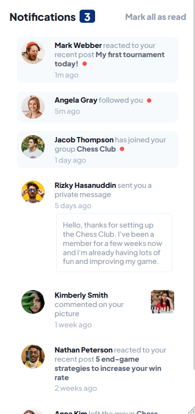

# Frontend Mentor - Notifications page solution

This is a solution to the [Notifications page challenge on Frontend Mentor](https://www.frontendmentor.io/challenges/notifications-page-DqK5QAmKbC). Frontend Mentor challenges help you improve your coding skills by building realistic projects. 

## Table of contents

- [Overview](#overview)
  - [The challenge](#the-challenge)
  - [Screenshot](#screenshot)
  - [Links](#links)
- [My process](#my-process)
  - [Built with](#built-with)
- [Author](#author)

## Overview

### The challenge

Users should be able to:

- Distinguish between "unread" and "read" notifications
- Select "Mark all as read" to toggle the visual state of the unread notifications and set the number of unread messages to zero
- View the optimal layout for the interface depending on their device's screen size
- See hover and focus states for all interactive elements on the page

### Screenshot

 ### Links

- Solution URL: [GitHub Repository](https://github.com/TomyAlberdi/Notifications-Page-Main)
- Live Site URL: [Add live site URL here](https://TomyAlberdi.github.io/Notifications-Page-Main/)

## My process

### Built with

- Mobile-first workflow
- Sass
- Flexbox

## Author

- Website - [Tomás Alberdi](https://tomyalberdi.github.io/Portfolio/)
- Frontend Mentor - [@TomyAlberdi](https://www.frontendmentor.io/profile/TomyAlberdi)
